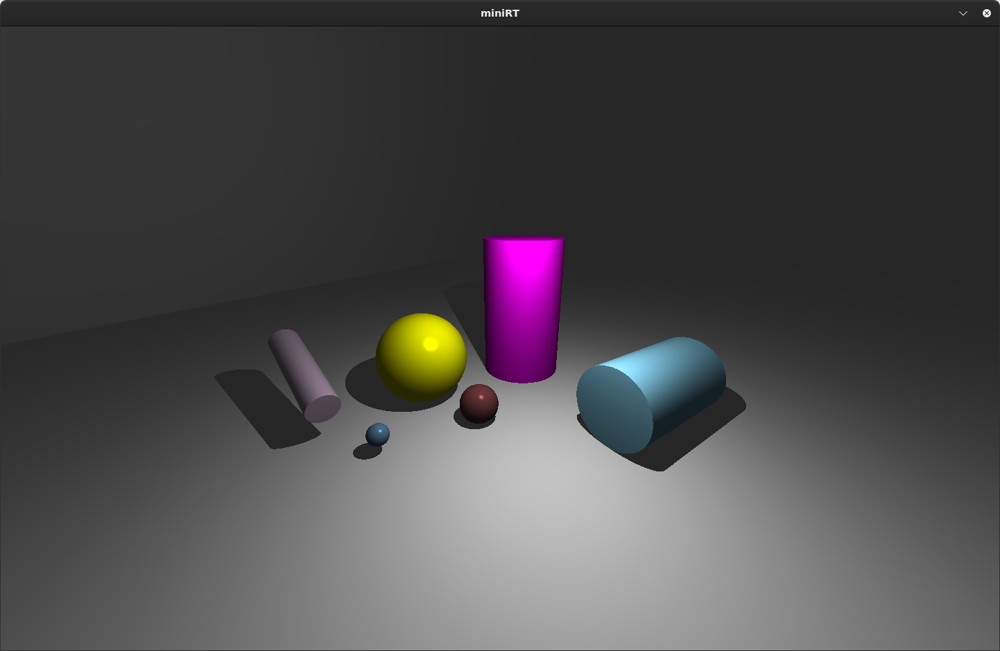
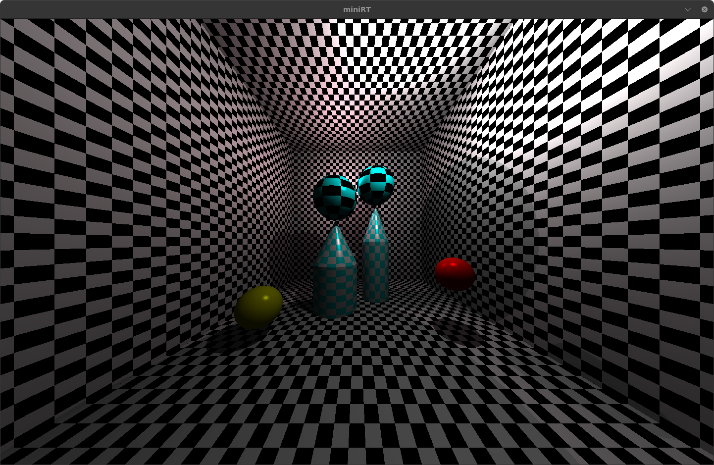
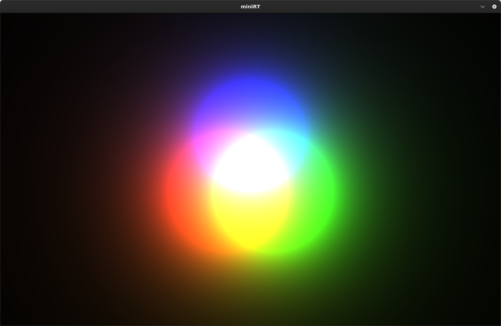
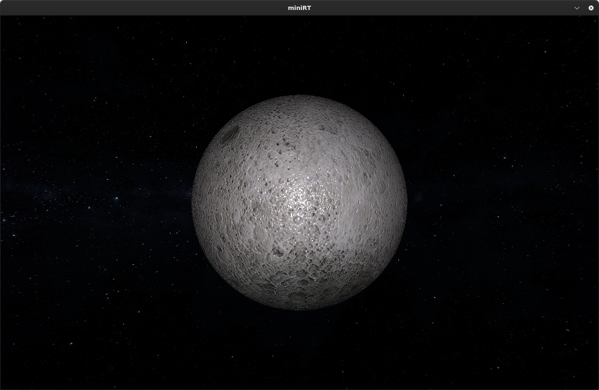
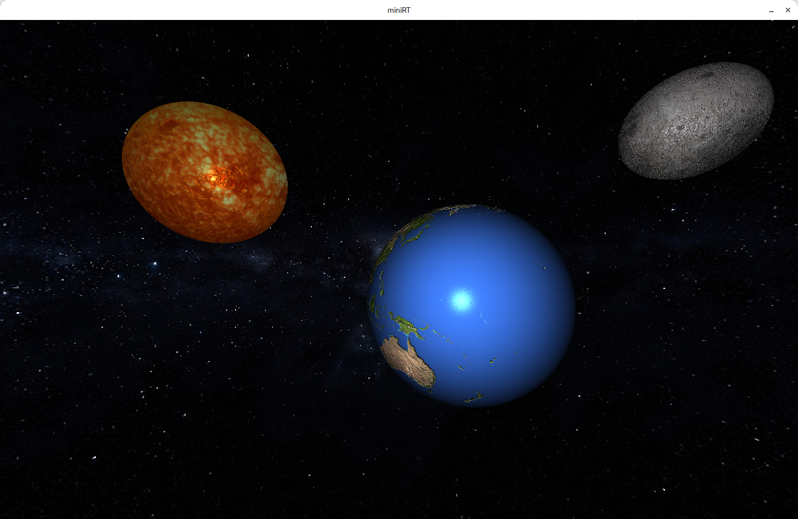
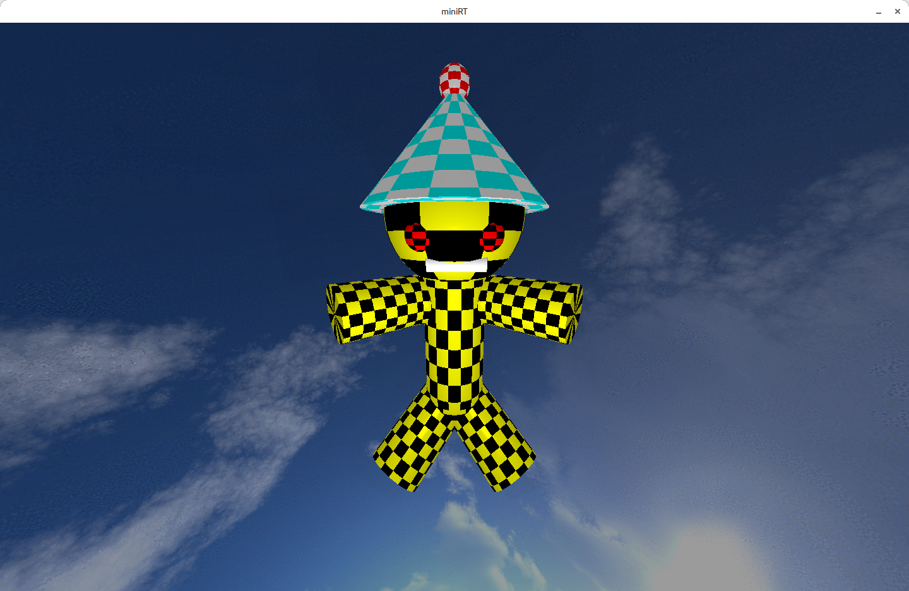
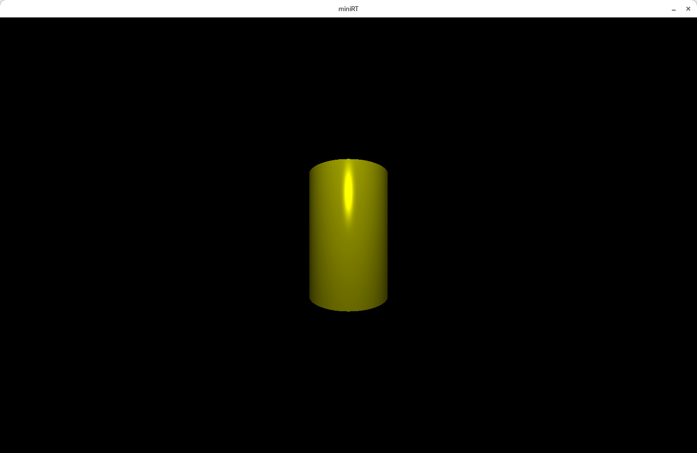
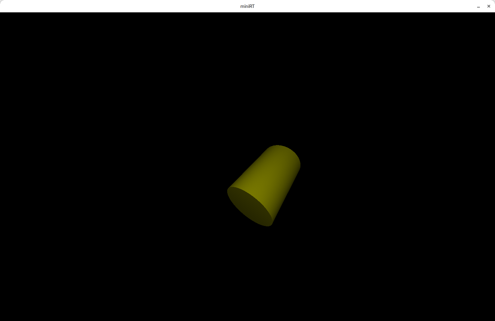
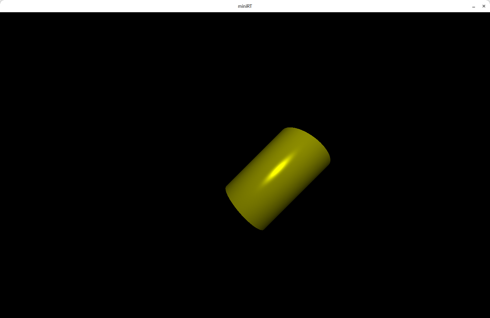

# 42-miniRT

[](https://shields.io/)
[](https://www.vim.org/)
[](https://shields.io/)

Welcome to the world of raytracing ! Discover our miniRT, a CPU-based raytracer, showcasing this wonderful project.

<br>


<br>
<details>
	<summary><b style="font-size:25px">More images!</b></summary>
	A chamber with multiple lights, checkered texture, cone and cylinder...
	
	Light synthesis example with a red, green, and blue light.
	
	The raytracer also support bump mapping. Here's a moon with a normal map applied.
	
	With multiple planets...
	
	A little guy made out of multiple shapes...
	
	
</details>

## Before reading

Note that we use a right-hand coordinate system, using the y-axis as the up vector and z-axis as the forward vector of our coordinate system.

Matrices are used in column-major order.

## How to use ?

Clone the repository using the `--recurse-submodules`, you can use the alias `gcl` if you're using oh-my-zsh.

For full experience compile the bonus version using `make`.
Each file must be terminated with the `.rt` extension.

```
git clone --recurse-submodules https://github.com/Exio666/42-miniRT
cd miniRT_bonus
make
./miniRT_bonus path_to_file.rt
```

## Creating a scene
:exclamation: Each component of the *orientation vector* is normalized beetween `[-1;1]`.

<details>
<summary> A scene can only have a single camera, defined by : </summary>

```
C xPos,yPos,zPos xDir,yDir,zDir   FOV
```
`Pos` is a point describing the camera position.

`Dir` is a vector orienting the camera.

`FOV` is the field of view.
</details>

***

<details>
<summary> And an ambient light, used to <i>simulate</i> indirect illumination : </summary>

```
A   Ratio   R,G,B
```

`Ratio` is the intensity of the light, between range `[0;1]`.

`R,G,B` is the color of the ambiant light, each component is between range `[0;255]`. 
</details>

***

<details>
<summary>Each scene can have an infinite number of lights :</summary>

```
L   xPos,yPos,zPos   Ratio   R,G,B
```

`Pos` is a point describing the light position.

`Ratio` is the intensity of the light, between range `[0;1]`.

`R,G,B` is the color of the ambiant light, each component is between range `[0;255]`. 
</details>

***

**Each line starts with an identifier, describing a shape.**

Our miniRT supports a couple of basic shapes :

* Finite closed cylinder : `cy`
* Finite closed cone : `cn`
* Sphere : `sp`
* Infinite plane : `pl`

***

<details>
	<summary>The cylinder :</summary>

```
cy    xPos,yPos,zPos    xDir,yDir,zDir    Lenght    Diameter    R,G,B
```

`Pos` is a point describing the cylinder position.

`Dir` is a vector orienting the cylinder.

`R,G,B` is the color of the cylinder, each component is between range `[0;255]`. 

`Lenght` and `Diameter` cannot be negative.
</details>

***

The **cone** shares the exact same description as the cylinder.

***

<details>
<summary>The sphere :</summary>

```
sp    xPos,yPos,zPos    Radius    R,G,B
```

`Pos` is a point describing the sphere position.

`R,G,B` is the color of the sphere, each component is between range `[0;255]`. 

`Radius` is the radius of the sphere.
</details>

***

<details>
	<summary>The plane:</summary>

```
pl    xPos,yPos,zPos    xDir,yDir,zDir    R,G,B
```

`Pos` is a point describing the plane position.

`Dir` is a vector orienting the plane.

`R,G,B` is the color of the plane, each component is between range `[0;255]`. 
</details>
<br>

You can apply a **checkered texture** on all shapes. After each object color declaration, add the following sentence :

```
checkered    R,G,B    R,G,B
```

Again, both colors must be in range of `[0;255]`. 

You can apply a **texture**, with a **normal map** or without, on a sphere, cylinder or cone,  with the following sentence :


```
texture           path_to_texture
```
OR
```
texture_normal    path_to_texture    path_to_normal_map_texture
```

## Orientation vector

Nothing better than images to explain our approch of this *orientation vector*.

Given a cylinder with an orientation vector `(0, 1, 0)`, the result is the following cylinder :

<details>
	
</details>
<br>

Given a cylinder with an orientation vector `(1, 1, 1)`, the result is the following cylinder :
<br>
<details>
	
</details>
<br>

Given a cylinder with an orientation vector `(1, 1, 0)`, the result is the following cylinder :
<br>
<details>
	
</details>
